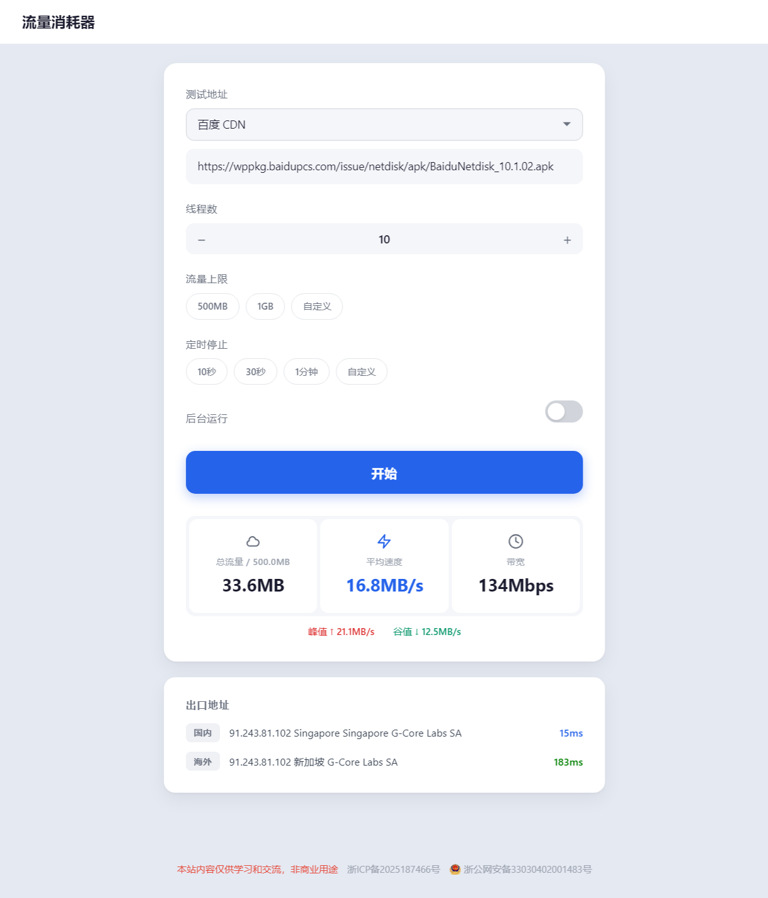

# 流量消耗器

一个纯前端的网络测速与流量消耗工具，可在浏览器中直接运行。

演示地址：https://llxhq.937788.xyz/

## 功能

- **多源测速**：内置百度 CDN、阿里 CDN、腾讯 CDN、字节跳动、京东、网易、小米、Vivo、和彩云、天翼云、咪咕视频、Cachefly 等 15 个测试节点，支持自定义测速地址
- **多线程下载**：支持 1-32 个并发线程，充分利用带宽
- **流量上限控制**：可设置 500MB / 1GB 或自定义流量上限，到达后自动停止
- **定时停止**：支持 10 秒、30 秒、1 分钟或自定义时长后自动停止
- **后台运行**：切换标签页或最小化窗口时，可选择继续后台测速
- **IP 地址查询**：同时检测国内和海外出口 IP 地址及归属地信息
- **网络延迟检测**：实时显示国内（华为云）和海外（Cloudflare）的网络延迟
- **峰值追踪**：记录测速过程中的最高速度和最低速度
- **响应式设计**：适配桌面端和移动端

## 技术栈

- 纯 HTML + CSS + JavaScript，无需构建工具
- 基于 Fetch API 的流式下载
- 使用 DashLite 风格 UI 框架

## 使用方法

1. 直接在浏览器中打开 `index.html`
2. 选择测试地址或输入自定义下载链接
3. 设置线程数（默认 10 个线程）
4. 可选：设置流量上限和定时停止
5. 点击"开始测速"
6. 查看实时速度、带宽、总流量、IP 信息和网络延迟

## 文件结构

```
.
├── index.html      # 主页面
├── main.js         # 核心测速逻辑
└── res/
    ├── dashlite.css  # UI 框架样式
    ├── style.css     # 自定义样式
    ├── background.mp3 # 背景音效（预留）
    ├── layer.css     # 附加样式
    └── Nioicon.ttf   # 图标字体
```

## 注意事项

- 测速过程会产生真实的网络流量，请留意流量消耗
- 仅支持 HTTPS 协议的测试地址（浏览器安全策略限制）
- 测试地址需要允许跨域（CORS）访问
- 建议在 WiFi 或宽带网络环境下使用，避免消耗移动数据流量

## 截图


